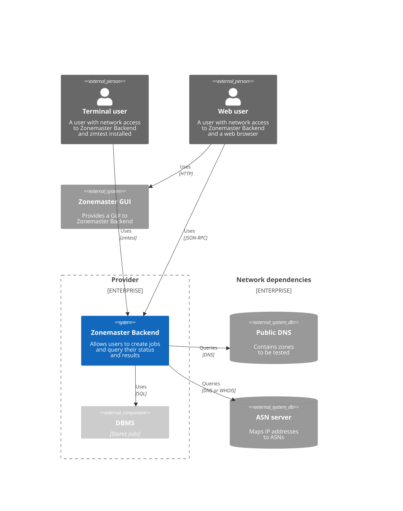
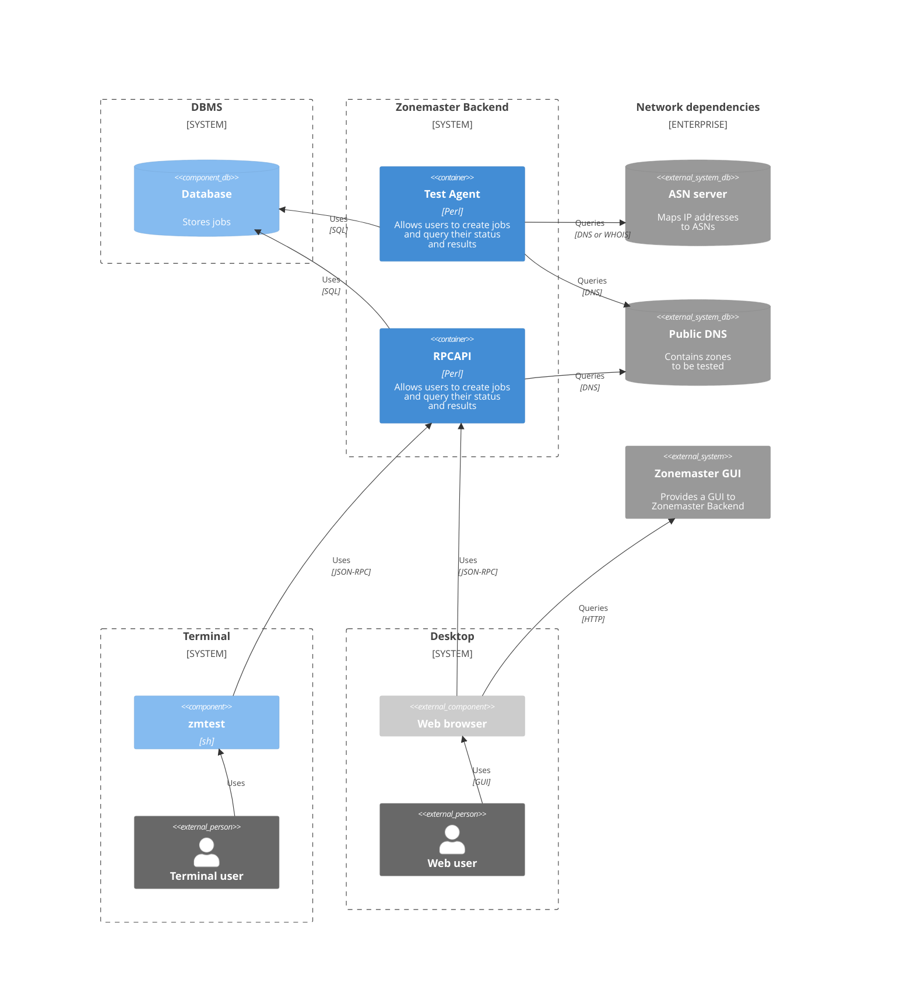
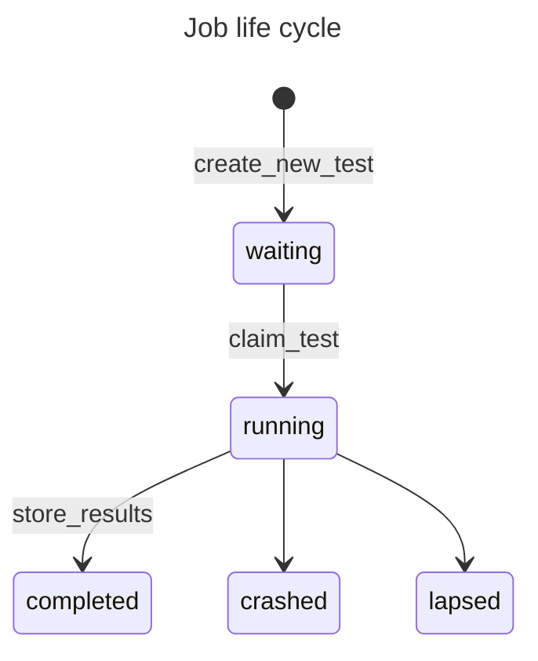

# Architecture
## C4 Context diagram

## C4 Container diagram

# Behavior

Backend is all about performing jobs.
A job is the unit of work.
A job is identified by a job id.

End users create jobs and Test Agent performs them.
End users can list historical jobs and get the status and result of individual jobs.

