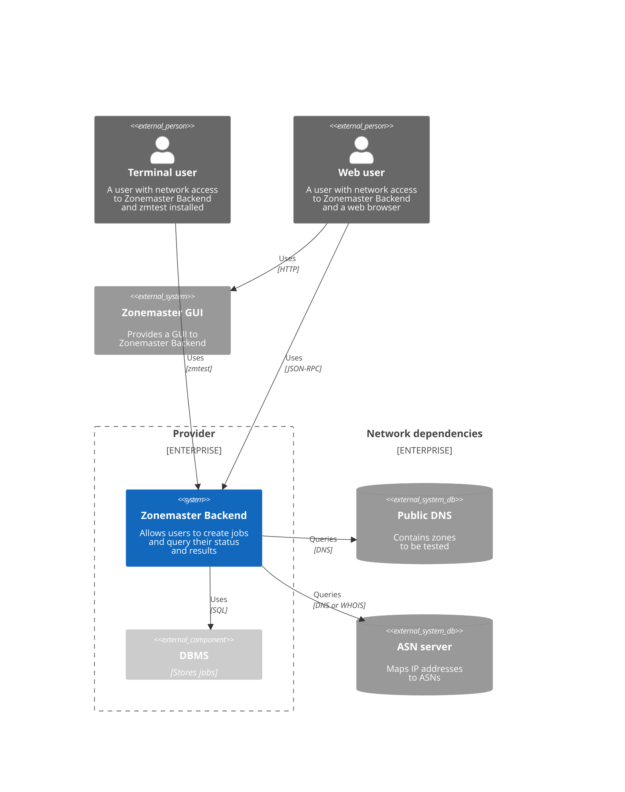
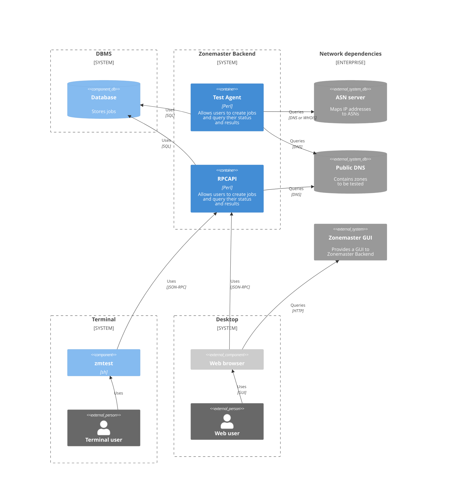
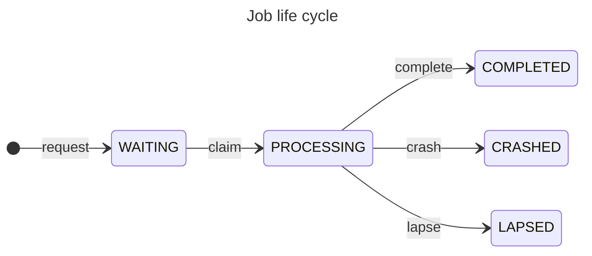

# Architecture
## C4 Context diagram

## C4 Container diagram

# Glossary

### Job

A job is a unit of work in Zonemaster Backend.
It follows a life cycle.

#### State: WAITING

The job is waiting to be processed.

#### State: PROCESSING

The job is being processed.
This means that a Zonemaster Engine test is being performed.

#### State: COMPLETED

This is an end state.
The job has been processed.
The Zonemaster Engine test ran to completion.
A report is available with the full test results.

#### State: CRASHED

This is an end state.
The job has been processed.
A critical error occurred while running.
A report is available with the partial test results.

#### State: LAPSED

This is an end state.
The job has been processed.
The processing was cancelled because it took too long. 
A report is available with the partial test results.

#### Meta-State: DONE

The job is in one of the COMPLETED, CRASHED or LAPSED states.
