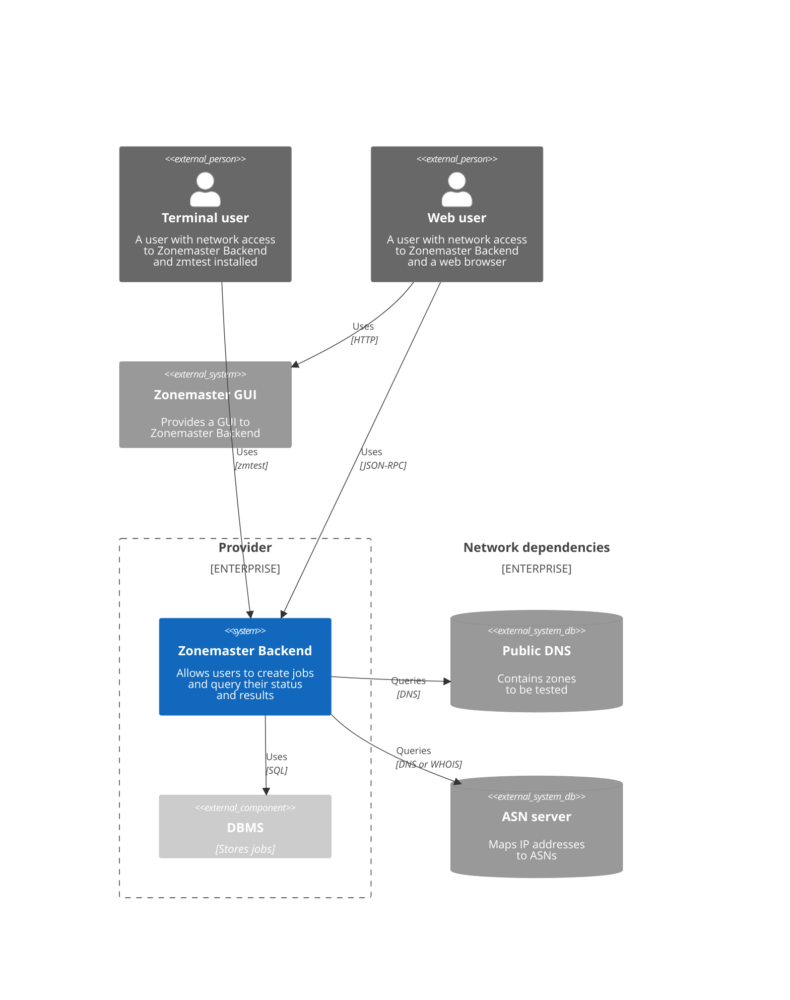
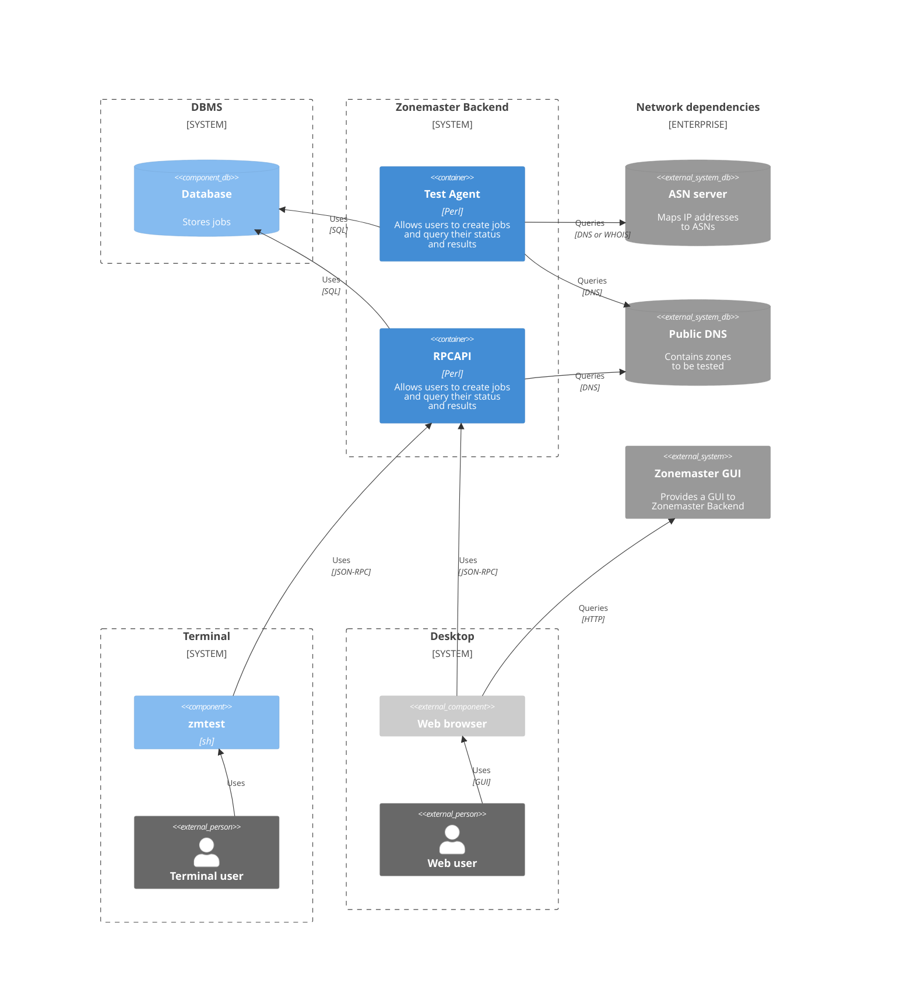
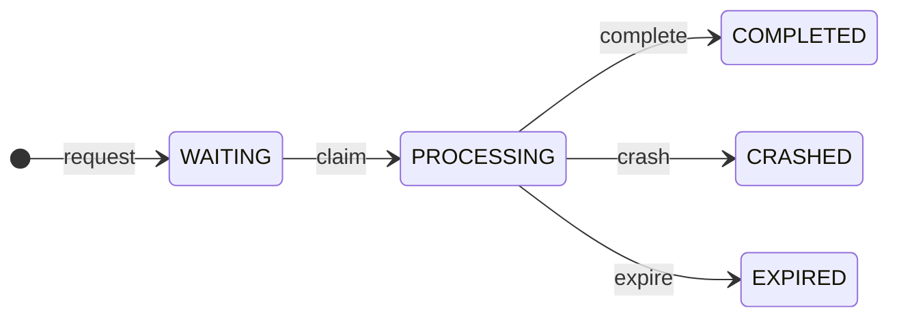

# Architecture
## C4 Context diagram

## C4 Container diagram

## C4 Component diagram - Database
A data store for persistent business objects.

{{ insert diagram here }}

## C4 Component diagram - RPCAPI

{{ insert diagram here }}

### Clerk
A server that responds to *job requests* and *questions* from users.  

**Job request**
* A synchronous request.
  Expresses the desire to have a [job] performed asynchronously.

  A *clerk* responds to a *job request* by first consulting the [database] for a matching [job] that is available for reuse.
  If there is such a job the *clerk* responds with its [job id].
  Otherwise it triggers the [creation][create] of a new [job] and responds with that [job id] instead.

**Question**
* A synchronous request.
  Expresses the need for some piece of information.

  A *clerk* responds to a *question* using information from the [database] and/or its [rpcapi configuration].
  It may also query the [public DNS] to answer certain questions.

### RPCAPI Configuration
A data store for Zonemaster Backend settings.

## C4 Component diagram - Test Agent

{{ insert diagram here }}

### Dispatcher
A broker that monitors and schedules the performing of [jobs].

A *dispatcher* notices [jobs][job] in the [WAITING] state, [claims][claim] them and delegates their processing to [workers][worker].
It also [expires][expire] [jobs][job] that have been in the [PROCESSING] state for too long.

### Test Agent Configuration
A data store for Zonemaster Backend settings.

### Worker
A thread that performs [jobs][job].

# State

## Job
A class of business objects persisted in the [database].
The principal unit of work in Zonemaster Backend.

Processing a *job* means executing a Zonemaster Engine test and performing associated bookkeeping tasks.

**Job id**
* An identifier.

  Every job has a unique *job id*.

### Job life cycle

**WAITING**
* The *job* is waiting to be processed.

**PROCESSING**
* The *job* is currently being processed.

**COMPLETED**
* The *job* was already processed.
  The Zonemaster Engine test terminated normally.
  A report is available with the full test results.

**CRASHED**
* The *job* was already processed.
  A critical error occurred while processing.
  A report is available with the partial test results.

**EXPIRED**
* The *job* was already processed.
  The processing was cancelled because it took too long. 
  A report is available with the partial test results.

**create**
* Triggered by a [clerk] when it receives a [job request] from a user and no matching *job* is available for reuse.

**claim**
* Triggered by a [dispatcher] when it notices that there is a [worker] available to process this *job*.

**complete**
* Triggered by a [worker] when the Zonemaster Engine test returns normally.

**crash**
* Triggered by a [worker] when a critical error occurs in the *PROCESSING* state.

**expire**
* Triggered by a [dispatcher] when a *job* has been in the *PROCESSING* state for too long.

[claim]: #job-life-cycle
[clerk]: #clerk
[create]: #job-life-cycle
[database]: #database
[dispatcher]: #dispatcher
[expire]: #job-life-cycle
[job]: #job
[job id]: #job
[job request]: #clerk
[processing]: #job-life-cycle
[question]: #clerk
[rpcapi configuration]: #rpcapi-configuration
[test agent configuration]: #test-agent-configuration
[waiting]: #job-life-cycle
[worker]: #worker
